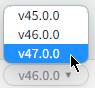

- [How to Deploy](#how-to-deploy)
- [Testing main application function](#testing-main-application-function)
  - [Initialization](#initialization)
  - [Initial Play Pause](#initial-play-pause)
  - [Subsequent Play Pause](#subsequent-play-pause)
  - [Secondary Audio Slider (Adding rain sounds)](#secondary-audio-slider-adding-rain-sounds)
  - [Secondary Audio Slider (Turning off rain sounds)](#secondary-audio-slider-turning-off-rain-sounds)
- [Testing the dynamic styling](#testing-the-dynamic-styling)

# How to Deploy 
This application is built on the Expo React Native Framework. The following deployment steps use Expo's cli tools for deployment. Steps taken from [expo's "creating your first build" webpage](https://docs.expo.dev/build/setup/)

1. Clone the **NatureSoundApp** source code to your computer via the command `git clone https://github.com/standeraumich/NatureSoundApp.git`
2. With a terminal opened and at the location of the `NatureSoundApp` folder, run `npm install -g eas-cli`
3. If have not made an account, go to [expo.dev](https://expo.dev/signup) and create a free account
4. After `eas-cli` has been installed, in your terminal run `eas login`
5. Input your account credentials 
6. Run `eas build:configure` and follow the prompted steps to deploy to either Android or iOS (or both)
7. Your deployment will build over expo's servers and the terminal will notify you when it is finished and give you a download link 

# Testing main application function
## Initialization
1. Navigate to [snack.expo.dev](https://snack.expo.dev/)
2. In the bottom horizontal menu select **v46.0.0** and change it to **47.0.0** 

    

3. In the bottom horizontal menu select **Editor**
4. Toggle the **Panel** option to **on** 

    

5. When the panel appears, select the **LOGS** window

    

6. In the **project tab** on the left, click the **three vertical dots**
7. Select the **Import git repository** option and paste the following repository `https://github.com/standeraumich/NatureSoundApp.git`

    

8. In the preview window select any device **NOTE: only *Web* will have sound, *iOS* and *Android* will not**

    

9. As the app loads the view the log output to determine the intialization test. 
10. Review the output of the logs, if it looks as screenshotted below, the test has completed without issues.

    

## Initial Play Pause
1. Click the play button in the application 
2. If on *Web* you should start to hear the main sound and see the play button turn into a pause button
3. Click the pause button. You should hear the main sound stop and the pause button turn into a play button
3. The log output of clicking play then pause should look like below

    

## Subsequent Play Pause
1. Repeat the steps in **Initial Play Pause**
2. The log output this time should look like below

    

## Secondary Audio Slider (Adding rain sounds)
1. Select the play button so audio start playing and the pause button appears 
2. Select the slider and slide it past any position greater than zero
3. The additional rain sound should be heard and the log output should look like below

    

## Secondary Audio Slider (Turning off rain sounds)
1. If the main audio is paused, select the main play button
2. Select the slider and slide it back to the zero position 
3. The additional rain sound should stop and the log output should look like below

    

# Testing the dynamic styling
1. On your personal device, In Google play or the App store, search for **Expo Go** download and install the application

    

2. Follow steps 1. through 7. in **Initialization** if you have not already
3. In the preview window select **My Device**

    

4. Open the **Expo Go** application on your personal phone 
5. Scan the qr code in the preview window

    

6. The same log output from **Testing main application function** will become present
7. To test the dynamic styling, we will change your device's time. If it is currently day time (before sunset) then manually change your personal device's time to a time that would be nighttime. If it is nighttime change your devices time to a time when the sun would be up 

    

8. Switch back to the expo application. 
9.  Visually, the background color, the header and play pause button will change color 
10. In the console log, the following output should be present: 

    

11. If it is the same as above, then the application has worked successfully
